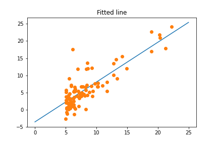

# SimpleLinearRegression
This repo was made for the Sistemas Expertos class at CETI Colomos. This repo contains a file called LinearRegression.ipynb with all the code necessarily 
to run a linear regression model using Gradient Descent optimization method and a file called data.csv with the values of X and Y correspondingly to train the model.
 
## Result
The resulted model using a beta of .024 and 600 iterations  was the following  
